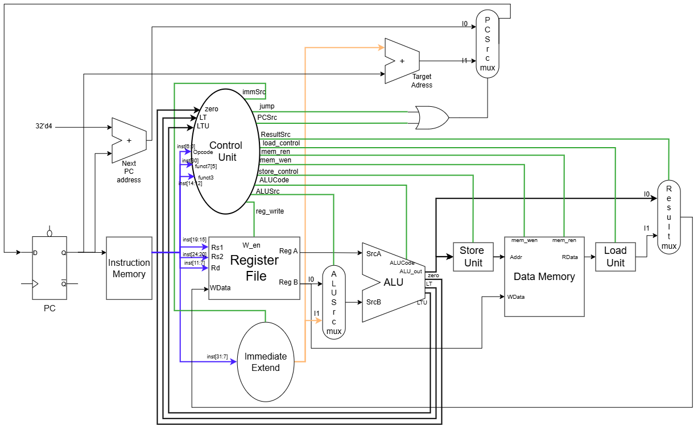
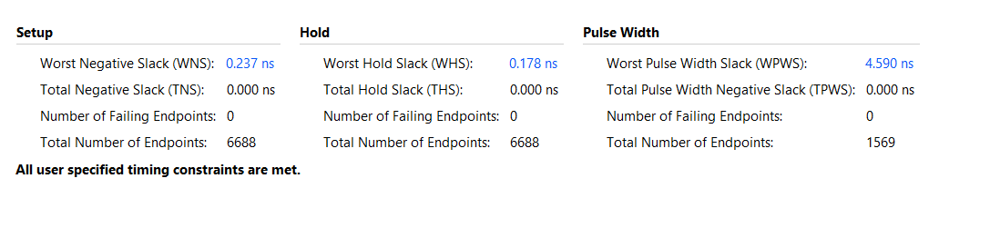
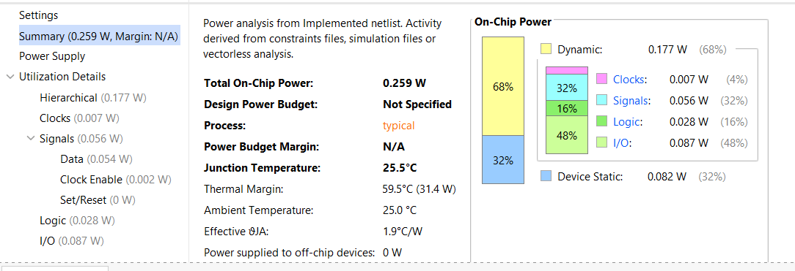
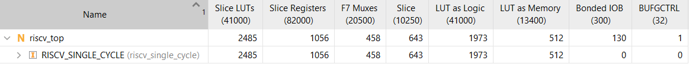

# SINGLE CYCLE RISCV PROCESSOR


This project implements a single cycle RISCV processor. A RISCV processor has the following 6 types of instructions:
| Sr.no | Type | Description |
|-------|------|-------------|
|1. | R-type | These instructions involve register as operands for any arithmetic or logical operations. |
|2. | I-type | These instructions require a register value and an immediate value for any arithmetic operations, or to fetch data from memory |
|3. | S-type | These instructions specify what data is supposed to be stored in the memory and at which address |
|4. | B-type | These instructions specify whether any conditional branching has to be done from the current PC position |
|5. | U-type | These instructions operate a 32-bit value, whose 20 MSBs are an immediate number followed by 12 trailing 0's |
|6. | J-type | These are similar to B-type, except that these instructions do not require any conditions. They jump to whichever location is specified in them |

## Design Overview



### Supported Instructions
| Instruction Type | Instruction supported |
|:------------------|:-----------------------|
|R-Type| ADD, SUB, AND, OR, XOR, SLT, SLTU, SLL, SRL, SRA |
|I-Type| ADDI, ANDI, ORI, XORI, SLTI, SLTUI, SLLI, SRLI, SRAI |
|I-Type (load)| LW, LB, LH, LBU, LHU |
|S-Type| SW, SB, SH |
|B-type| BEQ, BNE, BLT, BLTU |
|U-Type| LUI |
|J-Type| JAL, JALR | 

## File structure

```RISCV_SINGLE_CYCLE/
├── README.md
├── design
│   ├── ALU.sv
│   ├── PC_handler.sv
│   ├── PC_next.sv
│   ├── PC_target.sv
│   ├── Single_Cycle_Data_Path.sv
│   ├── adder.sv
│   ├── alu_decoder.sv
│   ├── branch_decoder.sv
│   ├── control_unit.sv
│   ├── data_mem.sv
│   ├── imm_extend.sv
│   ├── initial_reg.txt
│   ├── inst_mem.sv
│   ├── instructions.txt
│   ├── load_computation.sv
│   ├── main_decoder.sv
│   ├── memory.txt
│   ├── memory_bank_32_x_1024.sv
│   ├── reg_file.sv
│   ├── riscv_single_cycle.sv
│   ├── riscv_top.sv
│   ├── riscv_wrapper.sv
│   └── store_computation.sv
└── input_constraints.sdc
```
## Design Specs

The design was simulated and synthesized in AMD Vivado 2024.2 for a Kintex-7 based board.

The single cycle processor was targetted for a 50 MHz frequency. The design implemented in Vivado successfully matched the initial target frequency of 50MHz. After multiple modifications in constraints, the maximum frequency of the design was calculated to be around 90MHz, which is far more optimal than the initial target. The total power consumption came out to be 0.259 W.







## Functioning 

 - The instructions file contains a RISCV machine code to calculate the GCD of two numbers and store them in the data memory. It covers a majority of the instruction types (R, I, S, B, J)
 - To reduce huge fanout nets, the data memory (originally 1024 x 32) was divided into smaller banks. This improved the worst negative slack (WNS) significantly
 - The ALU only uses a 32-bit adder for any moderate scale operations which can contribute to critical delay. All the other operations are either derived from simple logical operators, or from the results of the adder. The need for a comparator is eliminated as signed and unsigned comparisions can be done entirely from the results of adder (during subtraction)
 - 3 signals other than the primary result output are generated from the ALU (zero, LT and LTU), which help in determining branch taken
 - All the adders in the design are implemented using Look-Ahead-Carry adder logic, to minimise LUTs as well as critical path delay


## Note
A parallel implementation of the design was also carried out using open source tools, namely Yosys (for synthesis) and OpenSTA (for timing). These tools were used to determine the actual synthesized area, power consumption and worst slack for 130nm node (Sky130 library). The memory modeled from this design's Verilog code is custom-made. Due to the presence of a large amount of registers and flip-flops in the memory, the synthesized design has a huge fanout between the ALU_out/store_computation data and the data memory (Even after dividing the memory into 8 banks, the decoding logic still produced over 8000 fanouts from a single ALU output signal), causing an unrealistic slack of -2000ns. One possible solution for this was to use SRAM cells from the sky130 library to model as memory. However, a single cycle processor cannot use a proper SRAM on its own.

Thus, in the next step of this implementation the design will be modified to a 5-stage pipelined RISCV Processor, which will be synthesized using both Vivado, and Yosys & OpenSTA for the Sky130 library.
